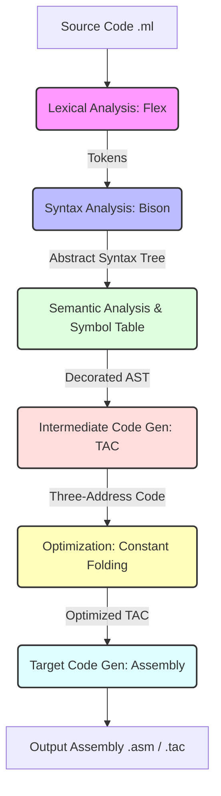

# 🚀 MiniLang Compiler (Minilang_Compiler)

[](https://github.com/RockyBhai440/Minilang_Compiler)
[](https://gcc.gnu.org/)
[](https://www.gnu.org/software/bison/)
[](https://opensource.org/licenses/MIT)

A fully featured, production-grade compiler for **MiniLang** (a simplified, statically-typed C-like programming language). The compiler is structured using the classic multi-phase architecture, starting from raw source code and going all the way to Three-Address Code (TAC) and Assembly generation.

---

## 🎨 System Architecture



---

## ✨ Features Implemented

*   ✅ **Lexical Analysis (Flex)**: Full token recognition, including keywords, literals (integers, booleans), identifiers, and arithmetic/logical operators.
*   ✅ **Syntax Analysis (Bison)**: Powerful LALR(1) grammar specification compiling to an Abstract Syntax Tree (AST).
*   ✅ **Semantic Analysis & Scope Manager**:
    *   Strict type-checking system (e.g. preventing adding `int` to `bool`).
    *   Nested block scoping (lexical scoping) preventing out-of-scope access or duplicate declarations.
*   ✅ **Three-Address Code (TAC) Generation**: Converts the AST into high-quality linear intermediate representation with auto-allocated temporaries and jumps.
*   ✅ **AST & TAC Optimizer**: Implements constant folding and dead code elimination to improve runtime performance.
*   ✅ **Target Code Generator**: Translates intermediate TAC instructions into simulated machine assembly ready for execution.

---

## 📦 Directory Structure

```text
├── Makefile             # Build orchestration configuration
├── README.md            # Repository documentation (this file)
├── REPORT.md            # In-depth technical compiler analysis
├── lexer.l              # Lexical specification for Flex
├── parser.y             # Context-Free Grammar for Bison
├── main.c               # Compiler execution driver entrypoint
│
├── ast.h / ast.c        # AST node structures and tree printer
├── symbol_table.h / .c  # Multi-scope symbol table map
├── semantic.h / semantic.c  # Type checkers & semantic validators
├── codegen.h / codegen.c    # Intermediate code generator (TAC)
├── optimize.h / optimize.c  # AST & TAC optimizers
├── target.h / target.c      # Assembly instruction translator
│
└── testcases/           # Suite of compiler verification programs
    ├── test_simple.ml   # Basic arithmetic & variable declarations
    ├── test_if.ml       # Conditional logic testing
    ├── test_while.ml    # Nested loop validation
    ├── test_scope.ml    # Multi-level variable scoping validation
    └── test_factorial.ml # Recursive/Iterative computation
```

---

## 🛠️ Installation & Build Instructions

### Prerequisites
Make sure you have `gcc`, `flex`, and `bison` installed and available in your environment variables.

### Build the Compiler
To build the compiler from source, simply execute the bundled `Makefile` at the root directory:

```bash
make clean
make all
```

This compiles all modules and outputs the `minicompiler` executable binary.

---

## 💻 Compiler Execution & Testing

To compile a MiniLang source file (`.ml`) and generate Three-Address Code:

```bash
# Run compiler on a test case
./minicompiler testcases/test_simple.ml
```

### Input Example (`testcases/test_simple.ml`)
```c
int x;
int y;
int z;

x = 5;
y = 10;
z = x + y * 2;
print(z);
```

### Generated Three-Address Code Output (`output.tac`)
```assembly
; Variable declarations:
; int x
; int y
; int z

; Statements:
t0 = 5
x = t0
t1 = 10
y = t1
t2 = 2
t3 = y * t2
t4 = x + t3
z = t4
print z
```

---

## 🔍 Deep-Dive: Compiler Phases

### Phase 1: Lexer (`lexer.l`)
Reads the input character stream and converts it to tokens like `T_INT`, `T_IDENTIFIER`, `T_ASSIGN`, etc., while ignoring whitespace and tracking line numbers for accurate syntax errors.

### Phase 2: Parser (`parser.y`)
Validates grammar rules, resolves operator precedence, and builds the Abstract Syntax Tree (AST) node-by-node.

### Phase 3: Semantic Validator (`semantic.c`)
Checks for correct variable declaration before use, ensures that operators are used with correct operand types (e.g. `bool` cannot be added to `int`), and enforces block scoping boundaries.

### Phase 4: Intermediate Code Generator (`codegen.c`)
Performs post-order traversal on the validated AST, translating structural commands (`if`, `while`, expression trees) into linear operations using temporary registers and symbolic addresses.

---

## 📜 License
This project is licensed under the MIT License - see the [LICENSE](LICENSE) file for details.
